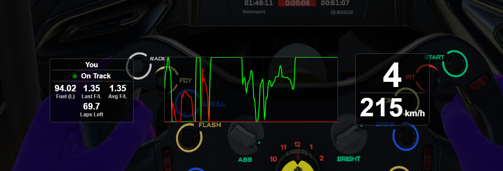

# iTelemetry

A modern, minimal overlay for iRacing that displays a real-time input graph for brake and throttle, as well as the current gear. Designed for clarity and ease of use, this overlay helps you visualize your driving inputs while racing.

---

## ✨ Features

-   **Input Graph:** Visualizes brake and throttle application in real time.
-   **Current Gear Display:** Always see which gear you're in.
-   **ABS Flasher:** If ABS engages the input graph background will flash yellow.
-   **Speedometer:** Always see your current speed.
-   **Movable & Resizable:** Easily reposition and resize the overlay to fit your setup.
-   **Fuel data:** See current fuel, fuel used last lap and rollig 5 lap average usage.
-   **Fuel sharing server:** Self hostable fuel sharing server for endurance races so you and your teammates can keep track of fuel usage

---

## Example picture



---

## ⌨️ Keyboard Shortcuts

-   `Alt + Q` — Close the application
-   `Alt + D` — Enter movable mode (move & resize the overlay)

---

## 🚀 Getting Started With Development

### Prerequisites

-   **Node.js** (v21+ recommended)
-   **node-gyp** (required for `iracing-sdk`)
    -   Install globally if not present: `npm install -g node-gyp`
    -   [node-gyp installation guide](https://github.com/nodejs/node-gyp#installation)

### Development Setup

1. **Install dependencies:**
    ```bash
    npm install
    ```

---

## 🖥️ Usage

### Start the Frontend

```bash
npm start
```

### Start the Fuel sharing server (optional)

To use the fuel sharing server you need to either host it online or run locally and then port forward the port that the server runs on (by default 8081). Make sure you have a public IP-address if you decide to self host the fuel sharing server.

```bash
cd server
```

```bash
npm start
```

---

## 📦 Download

The latest executable is available under [Releases](https://github.com/SaltyGaben/i-telemetry/releases).

---

## 📁 Project Structure

```
frontend/   # Overlay UI (TypeScript, HTML, CSS)
src/        # Main process, backend, preload scripts
server/     # Fuel sharing server
```

---

## 🛠️ Troubleshooting

-   If you encounter issues with `iracing-sdk`, ensure `node-gyp` and its build tools are installed correctly.
-   For Windows users, you may need to install [windows-build-tools](https://github.com/felixrieseberg/windows-build-tools) for node-gyp compatibility.

---

## 📃 License

This project is licensed under the [MIT License](./LICENSE).

---

## ☕ Buy Me a Coffee

If you find this project helpful and would like to support its development, consider buying me a coffee!

[](https://coff.ee/hampustuvesson)
